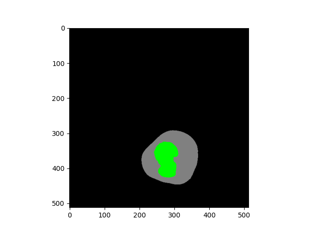
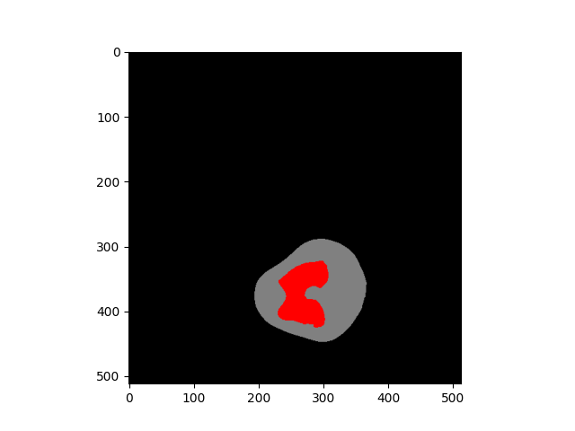
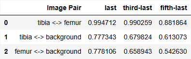

# Knee Feature Extraction and Similarity Comparison

## 🔬 Overview

This project implements a comprehensive pipeline for 3D knee CT image segmentation to identify and analyze three key anatomical regions (tibia, femur, and background) using a modified DenseNet121 architecture followed by cosine similarity analysis.

---

## ✨ Key Features

- **Segmentation**: Semi-automated mask generation of knee CT scan and colorful splitting
- **Model Conversion**: Adaptation of 2D pretrained DenseNet121 for 3D volumetric data
- **Feature Extraction**: Feature extraction from final few convolutional layers
- **Similarity Analysis**: Cosine similarity computation between anatomical regions

---

## Technical Approach

**Core Methods:**
- Semi-automated 3D mask preparation with color-coded labeling
- Slice-wise watershed segmentation for artifact removal
- Custom batch-wise thresholding for bone isolation
- 2D-to-3D DenseNet121 model conversion (PyTorch-based)
- Forward hook-based multi-layer deep feature extraction
- Global average pooling for feature vector generation
- Cosine similarity computation for inter-region comparison

**Stack:**
- Deep Learning: `torch`, `torchvision`
- Image Processing: `scikit-image`, `scipy`, `opencv`, `nibabel`
- Visualization: `matplotlib`, `mayavi`
- Data Handling: `numpy`, `pandas`

---

## 📝 Project Structure

```
bone_analysis/
├── utils/
│   ├── segmentation.py           # Segmentation & 3D rendering
│   ├── mask_generation.py     # Expansion and randomization
│   ├── model_conversion.py     # Landmark extraction
│   ├── feature_extraction.py     # Landmark extraction
│   ├── feature_comparison.py     # Landmark extraction
│   └── plots.py                  # 2D & 3D visualization helpers
├── notebooks/
│   └── notebook.ipynb            # Interactive Jupyter notebook
├── results/
│   └── cosine_similarity.csv     # Cosine simialrity results
├── images/
│   ├── mask.png                  # Batch of generated masks
│   ├── cosine_sim.png            # Dataframe Image of cosine similarity 
│   ├── seg_100                   # Segmentation result of slice 100
│   └── seg_110.png               # Segmentation result of slice 110
├── docs/
│   └── report.pdf                # Methodology report
├── requirements.txt              # Python dependencies
├── env.ps1                       # Windows setup script
└── readme.md                     # Project overview and instructions
```

---

## 🚀 Setup Instructions

### 🔧 Prerequisites

- Python 3.8+
- Git (to clone the repo)
- PowerShell (for Windows users)

### 💻 Installation

1. Clone the repository

    ```bash
    git clone https://github.com/a-b365/inside-cnn.git
    cd inside-cnn
    ```

2. Run the powershell script to add the environment variables:

    ```powershell
    .\env.ps1
    ```

3. Create and activate a virtual environment:

  - On macOS/Linux:
    ```bash
    python -m venv .venv
    source .venv/bin/activate
    ```

  - On Windows:
    ```powershell
    .\.venv\Scripts\activate
    ```

4. Install Dependencies

    Run:
    ```
    pip install -r requirements.txt
    ```
---

## 💻 Usage

### 1. Segmentation-Based Splitting
```python
# Segment 3D CT into anatomical regions
from segmentation import watershed_segmentation, create_tensor

labels = watershed_segmentation(volume_3d)

tensor_3d = create_tensor(bg_mask, labels, "background")
# Returns: tibia (green), femur (red), background (gray)
```

### 2. Model Conversion
```python
# Convert 2D DenseNet121 to 3D
from model_conversion import convert_densenet121

model_2d = models.densenet121(pretrained=True)

model_3d = convert_densenet121(model_2d)
```

### 3. Feature Extraction
```python
# Extract features from multiple layers
from feature_extraction import extract_gap_features

features = extract_gap_features(model_3d, tensor_3d, layers)
# Returns: features from last, 3rd-last, 5th-last layers
```

### 4. Feature Comparision
```python
# Compute cosine similarities
from feature_comparision import create_similarity_comparision_data, save_similarity_results

comparision_data = create_similarity_comparision_data(
  feature_lookup, region_pairs, layer_mapping
)

similarities = save_similarity_results(comparision_data, output_path)
# Saves results to CSV file
```

---

## 📊 Output

The pipeline generates:
- **Segmented 3D volumes** with color-coded anatomical regions

<div style="display: flex; gap: 10px;">
  
  
</div>

- **Feature vectors** from multiple abstraction levels
- **Similarity matrix** (CSV format) containing:
  - Tibia vs. Femur similarity scores
  - Tibia vs. Background similarity scores  
  - Femur vs. Background similarity scores


---

## Methodology

**Semi-automated Segmentation Strategy**
- Combines algorithmic processing with visual inspection
- Separates connected blob artifacts
- Batch-wise thresholding and noise removal for variable anatomical structures
- Systematic region labeling (Green=Tibia, Red=Femur, Gray=Background)

**Conversion process**: 
- 2D → 3D parameter mapping
- Weight replication along depth dimension
- Normalization by depth factor
- 3D kernel/stride/padding configuration

**Feature Extraction**
- Hook Mechanisms Captures intermediate representations during forward pass
- Global average pooling converts feature maps to fixed dimension vectors

---

## Usage

- Run the desired Python module directly from the command line.
- This will display one output at a time:
  - Segmentation: Apply segmentation and create a colorful mask.
  - Mask Generation: Creates grayscale masks for the femur, tibia, and the background.
  - Model Conversion: Prepare a 3D version of pretrained densenet121 model.
  - Feature Extraction: Convert the model's feature maps into an N-dimensional vector.
  - Feature Comparision: Analyze the similarities of the anatomical regions.
  - Plots: Visualizes the segmentation result.

---

## Notes

  - A detailed project report is available in the docs/ folder
  - Run the Jupyter notebook inside the notebooks/ folder for an interactive walkthrough of the implementation
  - Visual outputs and intermediate results can be found in the images/ directory.

---

